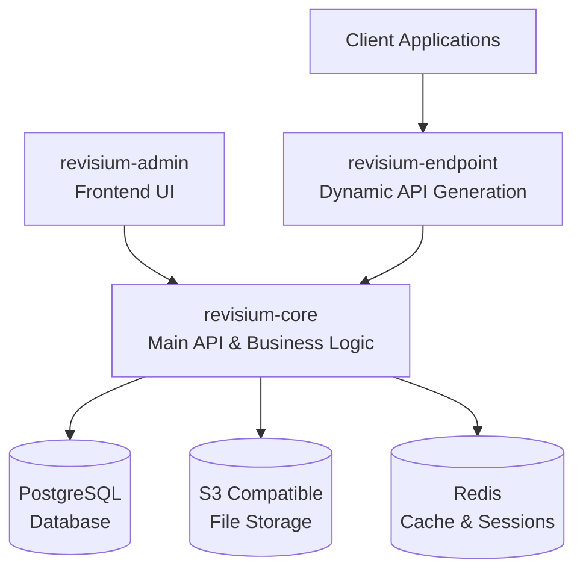
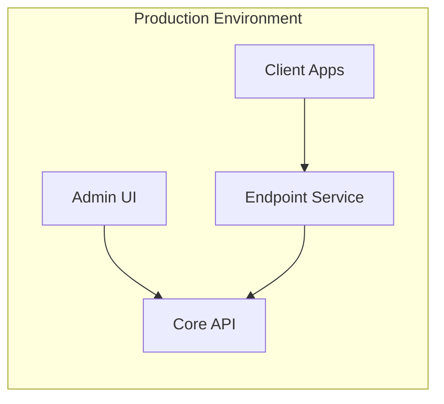
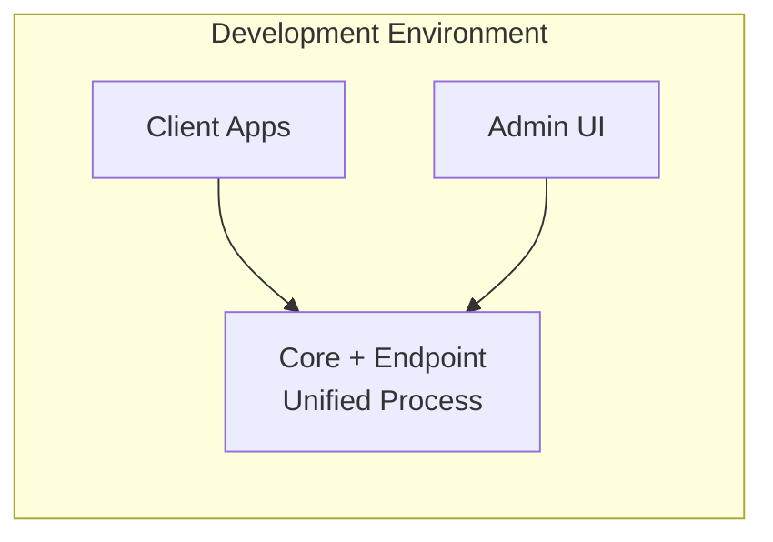

# Architecture

Revisium is a modular headless CMS system with Git-like version control, consisting of multiple interconnected components that work together to provide a complete data management platform.

## System Overview



## Core Components

### revisium-core
The central backbone of the Revisium ecosystem, providing:

- **Data Management**: CRUD operations, schema validation, relationship handling
- **Version Control**: Git-like branching, commits, and revision tracking
- **User Management**: Authentication, authorization, multi-tenancy
- **File Handling**: S3-compatible storage integration
- **Business Logic**: Complex data transformations and validations

**Technology Stack:**
- NestJS with TypeScript
- PostgreSQL with Prisma ORM
- GraphQL (Apollo Server) + REST APIs
- JWT authentication with CASL authorization
- CQRS pattern with event sourcing

### revisium-endpoint
A proxy service that generates dynamic APIs based on schemas stored in revisium-core:

- **Dynamic API Generation**: Creates GraphQL and REST endpoints from JSON schemas
- **Schema Synchronization**: Automatically updates when schemas change in core
- **Revision Awareness**: Provides APIs for specific data revisions (draft, head, or specific commits)
- **Performance Optimization**: Caching and query optimization

**Key Features:**
- Automatic GraphQL schema generation
- Relay-style pagination
- Advanced filtering and sorting
- Relationship resolution
- Real-time schema updates

### revisium-admin
Web-based administration interface for content management:

- **Visual Schema Designer**: Create and modify data structures
- **Content Editor**: Manage data with form-based interfaces
- **Version Control UI**: Branching, committing, and revision management
- **User Management**: Role-based access control
- **File Manager**: Upload and organize media files

**Technology Stack:**
- React 18 with TypeScript
- Vite build tool
- Chakra UI components
- MobX state management
- Apollo Client for GraphQL

## Architecture Patterns

### Git-like Version Control
Revisium implements version control concepts familiar from Git:

- **Projects**: Root containers (like repositories)
- **Branches**: Independent development lines
- **Commits**: Immutable snapshots of project state
- **Head**: Current production revision
- **Draft**: Working state before committing

### Microservices Architecture

#### Deployment Modes

**Microservice Mode (Production)**


**Monolith Mode (Development)**


### Data Flow

1. **Schema Definition**: Define data structures via Admin UI or API
2. **Schema Storage**: Schemas stored as JSON Schema in revisium-core
3. **API Generation**: revisium-endpoint dynamically generates GraphQL/REST APIs
4. **Data Operations**: Clients interact with generated APIs
5. **Version Control**: Changes tracked through commits and branches

## Communication Patterns

### Core ↔ Endpoint Communication
```bash
# Microservice mode
CORE_API_URL=https://core-api.example.com
CORE_API_USERNAME=endpoint_service
CORE_API_PASSWORD=secure_token

# Monolith mode (no external calls)
NODE_ENV=development
```

### Authentication & Authorization
- **JWT Tokens**: Stateless authentication across services
- **CASL Permissions**: Attribute-based access control
- **Multi-tenant**: Organization and project-level isolation

### Data Consistency
- **Event Sourcing**: All changes tracked as events
- **CQRS Pattern**: Separate read/write operations
- **Transaction Support**: Atomic operations across related data

## Next Steps

- [Getting Started Guide](../getting-started/) - Set up your first Revisium project
- [Endpoints Documentation](../endpoints/) - Learn about API generation and usage
- [Deployment Guide](../deployment/) - Production deployment strategies