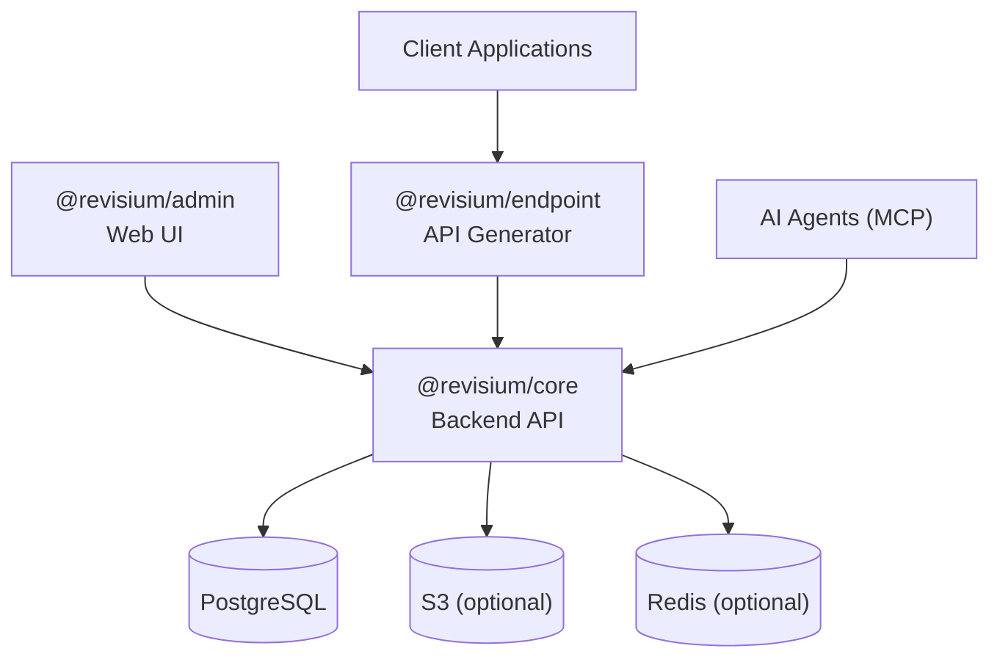

# Architecture

Revisium is a modular platform consisting of three main services that can be deployed together or separately.

## System Overview



## Components

### @revisium/core

Central backbone — all business logic, data management, and version control:

- CRUD operations with schema validation
- Git-like versioning (branches, revisions, drafts)
- Authentication (JWT) and authorization (CASL)
- File handling (S3 integration)
- MCP server
- GraphQL + REST System API

**Stack:** NestJS, TypeScript, PostgreSQL (Prisma), Apollo Server, CQRS with event sourcing

### @revisium/endpoint

Dynamic API generation from schemas:

- Generates typed GraphQL schemas from JSON Schema
- Generates REST/OpenAPI endpoints
- Relay-style pagination, filtering, sorting
- Foreign key relationship resolution
- Apollo Federation support

**Stack:** NestJS, TypeScript, Apollo Server

### @revisium/admin

Web-based administration interface:

- Visual schema editor
- Table editor with views, filters, sorts
- Row editor (form + JSON)
- Change review and diff
- Branch management, revision history
- Endpoint management

**Stack:** React 18, TypeScript, Vite, Chakra UI, MobX, Apollo Client

## Deployment Modes

### All-in-One (default)

All three services run in a single process. Used in the Docker image and standalone package.

```
revisium (single process)
├── @revisium/core
├── @revisium/admin (static files)
└── @revisium/endpoint
```

### Microservice

Services deployed separately for horizontal scaling:

```
@revisium/admin → @revisium/core ← @revisium/endpoint
                        ↓
                   PostgreSQL
```

Configure via `CORE_API_URL`, `CORE_API_USERNAME`, `CORE_API_PASSWORD` on the endpoint service.

## Data Flow

1. **Schema definition** — via Admin UI or System API
2. **Schema storage** — JSON Schema stored in PostgreSQL
3. **API generation** — endpoint service generates GraphQL/REST from schemas
4. **Data operations** — clients query generated APIs
5. **Version control** — all changes tracked through revisions

## Key Patterns

| Pattern | Usage |
|---------|-------|
| **CQRS** | Separate command and query handlers in core |
| **Event Sourcing** | All changes tracked as events |
| **Copy-on-Write** | Efficient revision storage in PostgreSQL |
| **CASL Abilities** | Declarative, attribute-based permissions |

## Ecosystem

See the [GitHub repository](https://github.com/revisium/revisium) for the full list of packages and their relationships.
