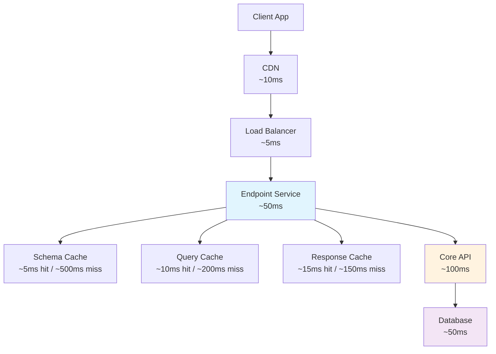

# Performance Optimization

Comprehensive guide to optimizing Revisium Endpoint performance across all layers of the architecture.

import Tabs from '@theme/Tabs';
import TabItem from '@theme/TabItem';

## Performance Architecture

Understanding the performance characteristics of each component in the endpoint architecture.



## Query Performance Optimization

Optimize GraphQL query execution and response times.

<Tabs>
<TabItem value="query-complexity" label="Query Complexity Analysis">

```typescript
// Query complexity analysis
const queryComplexityRules = {
  maximumComplexity: 1000,
  introspection: true,
  scalarCost: 1,
  objectCost: 2,
  listFactor: 10,
  createError: (max: number, actual: number) => 
    new Error(`Query is too complex: ${actual}. Maximum allowed complexity: ${max}.`)
};

// Example complexity calculations
const simpleQuery = `
  query GetUser($id: String!) {
    user(id: $id) {     # Cost: 2 (object)
      id                # Cost: 1 (scalar)
      data {            # Cost: 2 (object)
        name            # Cost: 1 (scalar)
        email           # Cost: 1 (scalar)
      }
    }
  }
`;
// Total complexity: 7

const complexQuery = `
  query GetUsersWithPosts {
    users(data: { first: 100 }) {  # Cost: 2 * 10 (list factor)
      edges {                     # Cost: 2 (object) 
        node {                    # Cost: 2 (object)
          data {                  # Cost: 2 (object)
            posts(data: { first: 50 }) { # Cost: 2 * 10 * 10 (nested list)
              edges {             # Cost: 2 (object)
                node {            # Cost: 2 (object)
                  data {          # Cost: 2 (object)
                    title         # Cost: 1 (scalar)
                  }
                }
              }
            }
          }
        }
      }
    }
  }
`;
// Total complexity: ~22,000 (exceeds limit)
```

**Optimization strategies:**
- Limit list sizes with reasonable `first` values
- Avoid deep nesting of list queries
- Use fragments to reduce query duplication
- Implement query whitelisting for production

</TabItem>
<TabItem value="field-selection" label="Field Selection Optimization">

```graphql
# ❌ Over-fetching - requesting unnecessary data
query GetUsersInefficient {
  users(data: { first: 100 }) {
    edges {
      node {
        id
        createdAt
        updatedAt
        publishedAt
        versionId
        json              # Large field
        data {
          name
          email
          profile {
            bio           # Large field
            avatar
            preferences {
              theme
              language
              notifications
              settings    # Large nested object
            }
          }
          posts {         # Expensive relationship
            totalCount
            edges {
              node {
                data {
                  title
                  content # Large field
                }
              }
            }
          }
        }
      }
    }
  }
}

# ✅ Optimized - only essential fields
query GetUsersOptimized {
  users(data: { first: 20 }) {    # Reasonable page size
    edges {
      node {
        id
        data {
          name
          email
          # Only essential profile fields
          profile {
            avatar
          }
        }
      }
    }
    totalCount
  }
}
```

**Best practices:**
- Request only needed fields
- Use separate queries for detailed views
- Implement progressive loading
- Consider flat types for simple data access

</TabItem>
<TabItem value="batching" label="Query Batching">

```typescript
// DataLoader for N+1 query prevention
import DataLoader from 'dataloader';

class CoreAPIDataLoader {
  private userLoader = new DataLoader(async (userIds: string[]) => {
    // Batch load users from Core API
    const users = await this.coreAPI.getUsersByIds(userIds);
    return userIds.map(id => users.find(user => user.id === id));
  });

  private profileLoader = new DataLoader(async (userIds: string[]) => {
    // Batch load profiles from Core API
    const profiles = await this.coreAPI.getProfilesByUserIds(userIds);
    return userIds.map(id => profiles.find(profile => profile.user_id === id));
  });

  async getUser(id: string) {
    return this.userLoader.load(id);
  }

  async getProfile(userId: string) {
    return this.profileLoader.load(userId);
  }
}

// GraphQL resolver using DataLoader
const resolvers = {
  ProjectUser: {
    profile: (parent, args, { dataLoader }) => {
      return dataLoader.getProfile(parent.id);
    }
  }
};
```

**Benefits:**
- Eliminates N+1 queries
- Batches requests to Core API
- Reduces network round trips
- Improves query response times

</TabItem>
</Tabs>

## Core API Optimization

Optimize communication with Revisium Core API.

<Tabs>
<TabItem value="connection-pooling" label="Connection Pooling">

```typescript
// HTTP connection pooling configuration
import { Agent } from 'https';

const httpsAgent = new Agent({
  keepAlive: true,
  keepAliveMsecs: 30000,
  maxSockets: 50,        # Maximum connections per host
  maxFreeSockets: 10,    # Keep alive connections
  timeout: 30000,        # Connection timeout
  freeSocketTimeout: 30000 # Free socket timeout
});

// Core API client with connection pooling
export class CoreAPIClient {
  constructor() {
    this.httpClient = axios.create({
      baseURL: process.env.CORE_API_URL,
      timeout: 30000,
      httpsAgent,
      // Connection optimization
      headers: {
        'Connection': 'keep-alive',
        'Keep-Alive': 'timeout=30, max=50'
      }
    });
  }
}
```

</TabItem>
<TabItem value="request-optimization" label="Request Optimization">

```typescript
// Optimized Core API requests
class OptimizedCoreAPI {
  // Batch multiple requests
  async batchRequests(requests: ApiRequest[]) {
    const batched = this.groupRequestsByEndpoint(requests);
    const results = await Promise.all(
      batched.map(batch => this.executeBatch(batch))
    );
    return this.mergeResults(results);
  }

  // Parallel execution for independent requests
  async getProjectData(projectId: string) {
    const [schemas, revisions, metadata] = await Promise.all([
      this.getSchemas(projectId),
      this.getRevisions(projectId), 
      this.getProjectMetadata(projectId)
    ]);

    return { schemas, revisions, metadata };
  }

  // Request compression
  async compressedRequest(data: any) {
    const compressed = gzip(JSON.stringify(data));
    return this.httpClient.post('/api/endpoint', compressed, {
      headers: {
        'Content-Encoding': 'gzip',
        'Content-Type': 'application/json'
      }
    });
  }
}
```

</TabItem>
<TabItem value="retry-strategy" label="Retry Strategy">

```typescript
// Exponential backoff retry strategy
import { retry } from 'ts-retry-promise';

class ResilientCoreAPI {
  async makeRequest(request: ApiRequest) {
    return retry(
      async () => {
        const response = await this.httpClient.request(request);
        
        // Only retry on specific errors
        if (response.status >= 500) {
          throw new Error(`Server error: ${response.status}`);
        }
        
        return response;
      },
      {
        retries: 3,
        delay: 1000,
        backoff: 'EXPONENTIAL',
        factor: 2,
        maxDelay: 10000,
        // Only retry on network errors and 5xx responses
        retryIf: (error: any) => {
          return error.code === 'ECONNRESET' || 
                 error.code === 'ETIMEDOUT' ||
                 (error.response && error.response.status >= 500);
        }
      }
    );
  }
}
```

</TabItem>
</Tabs>

## Database Query Optimization

Optimize queries sent to Core API that translate to database operations.

<Tabs>
<TabItem value="efficient-filtering" label="Efficient Filtering">

```graphql
# ✅ Efficient filtering using indexed fields
query EfficientUserQuery {
  users(data: {
    where: {
      # System fields are indexed
      createdAt: { gte: "2025-01-01T00:00:00Z" }
      readonly: false
      
      # Simple JSON path filters
      data: { path: ["status"], equals: "active" }
    }
    first: 20
  }) {
    edges {
      node {
        id
        data {
          name
          status
        }
      }
    }
  }
}

# ⚠️ Less efficient - complex JSON path filters
query ComplexUserQuery {
  users(data: {
    where: {
      # Deep nested JSON paths are slower
      data: { 
        path: ["profile", "settings", "preferences", "notifications", "email"], 
        equals: true 
      }
    }
  }) {
    edges {
      node {
        id
      }
    }
  }
}
```

**Performance tips:**
- Use system fields for filtering when possible
- Keep JSON paths shallow (max 2-3 levels)
- Combine filters to reduce result sets early
- Use appropriate data types in JSON path ordering

</TabItem>
<TabItem value="pagination-optimization" label="Pagination Optimization">

```graphql
# ✅ Efficient pagination
query EfficientPagination($after: String) {
  users(data: {
    first: 25,                    # Reasonable page size
    after: $after,
    orderBy: [
      { field: createdAt, direction: desc },
      { field: id, direction: asc }  # Stable sort for consistent pagination
    ]
  }) {
    edges {
      node {
        id
        data {
          name
        }
      }
      cursor
    }
    pageInfo {
      hasNextPage
      endCursor
    }
  }
}

# ❌ Inefficient - large page sizes
query InefficientPagination {
  users(data: {
    first: 500,                   # Too large, may cause timeouts
    orderBy: [
      { field: createdAt, direction: desc }
      # Missing stable sort field - inconsistent pagination
    ]
  }) {
    edges {
      node {
        id
        data {
          name
          # Many fields increase response size
          email
          profile {
            bio
            preferences {
              settings
            }
          }
        }
      }
    }
  }
}
```

</TabItem>
</Tabs>

## Memory and CPU Optimization

Optimize resource usage in the endpoint service.

<Tabs>
<TabItem value="memory-management" label="Memory Management">

```typescript
// Memory-efficient GraphQL execution
class MemoryEfficientExecutor {
  private schemaCache = new LRU<string, GraphQLSchema>({
    max: 100,              # Limit cached schemas
    maxAge: 1000 * 60 * 30 # 30 minute TTL
  });

  private responseCache = new LRU<string, any>({
    max: 1000,             # Limit cached responses
    maxAge: 1000 * 60 * 5, # 5 minute TTL
    length: (item) => JSON.stringify(item).length # Size-based eviction
  });

  // Stream large responses to avoid memory spikes
  async streamLargeQuery(query: string, variables: any) {
    const stream = new PassThrough({ objectMode: true });
    
    // Execute query in chunks
    let offset = 0;
    const chunkSize = 100;
    
    while (true) {
      const chunk = await this.executeQuery(query, {
        ...variables,
        offset,
        limit: chunkSize
      });
      
      if (chunk.length === 0) break;
      
      chunk.forEach(item => stream.write(item));
      offset += chunkSize;
      
      // Prevent memory buildup
      if (offset % 1000 === 0) {
        await new Promise(resolve => setImmediate(resolve));
      }
    }
    
    stream.end();
    return stream;
  }
}
```

</TabItem>
<TabItem value="cpu-optimization" label="CPU Optimization">

```typescript
// CPU optimization strategies
class CPUOptimizedService {
  // Schema compilation caching
  private compiledSchemas = new Map<string, CompiledQuery>();

  async executeQuery(query: string, variables: any) {
    // Use compiled queries for better performance
    let compiled = this.compiledSchemas.get(query);
    if (!compiled) {
      compiled = compileQuery(this.schema, parse(query));
      this.compiledSchemas.set(query, compiled);
    }

    return compiled.query(null, variables);
  }

  // Worker threads for heavy processing
  async processHeavyQuery(query: string) {
    return new Promise((resolve, reject) => {
      const worker = new Worker('./heavy-query-worker.js', {
        workerData: { query }
      });

      worker.on('message', resolve);
      worker.on('error', reject);
      worker.on('exit', (code) => {
        if (code !== 0) {
          reject(new Error(`Worker stopped with exit code ${code}`));
        }
      });
    });
  }

  // Async iteration for large datasets
  async* processLargeDataset(dataSource: AsyncIterable<any>) {
    for await (const batch of dataSource) {
      // Process batch asynchronously
      const processed = await this.processBatch(batch);
      yield processed;
      
      // Yield control periodically
      await new Promise(resolve => setImmediate(resolve));
    }
  }
}
```

</TabItem>
<TabItem value="garbage-collection" label="Garbage Collection Optimization">

```bash
# Node.js GC optimization flags
NODE_OPTIONS="--max-old-space-size=2048 --gc-interval=100"

# Production GC settings
NODE_OPTIONS="
  --max-old-space-size=4096
  --max-semi-space-size=512
  --optimize-for-size
  --gc-interval=100
  --expose-gc
"
```

```typescript
// Manual GC triggers for memory-intensive operations
class GCOptimizedService {
  async processLargeOperation() {
    try {
      // Perform memory-intensive operation
      const result = await this.heavyProcessing();
      return result;
    } finally {
      // Force GC after heavy operations
      if (global.gc) {
        global.gc();
      }
    }
  }

  // Monitor memory usage
  monitorMemoryUsage() {
    const memUsage = process.memoryUsage();
    
    // Log memory metrics
    console.log({
      rss: `${Math.round(memUsage.rss / 1024 / 1024)}MB`,
      heapTotal: `${Math.round(memUsage.heapTotal / 1024 / 1024)}MB`,
      heapUsed: `${Math.round(memUsage.heapUsed / 1024 / 1024)}MB`,
      external: `${Math.round(memUsage.external / 1024 / 1024)}MB`
    });

    // Trigger warning if memory usage is high
    if (memUsage.heapUsed > memUsage.heapTotal * 0.9) {
      console.warn('High memory usage detected');
    }
  }
}
```

</TabItem>
</Tabs>

## Response Optimization

Optimize GraphQL response processing and delivery.

<Tabs>
<TabItem value="compression" label="Response Compression">

```typescript
// Response compression middleware
import compression from 'compression';

app.use(compression({
  // Compress responses > 1KB
  threshold: 1024,
  
  // Compression level (1-9, 6 is good balance)
  level: 6,
  
  // Only compress specific content types
  filter: (req, res) => {
    if (req.headers['x-no-compression']) {
      return false;
    }
    return compression.filter(req, res);
  }
}));

// Brotli compression for modern browsers
import { createBrotliCompress } from 'zlib';

app.use('/graphql', (req, res, next) => {
  const acceptEncoding = req.headers['accept-encoding'] || '';
  
  if (acceptEncoding.includes('br')) {
    res.setHeader('Content-Encoding', 'br');
    const brotli = createBrotliCompress({
      params: {
        [constants.BROTLI_PARAM_QUALITY]: 4
      }
    });
    res.pipe(brotli);
  }
  
  next();
});
```

</TabItem>
<TabItem value="streaming" label="Response Streaming">

```typescript
// Streaming GraphQL responses for large datasets
import { execute } from 'graphql';

async function streamingExecute(schema, query, variables) {
  const stream = new PassThrough({ objectMode: true });
  
  // Execute query with custom resolver
  const result = await execute({
    schema,
    document: query,
    variableValues: variables,
    fieldResolver: async (source, args, context, info) => {
      // Stream large lists instead of loading all at once
      if (info.returnType.toString().includes('Connection')) {
        const asyncIterator = createAsyncIterator(source, args);
        
        for await (const chunk of asyncIterator) {
          stream.write(chunk);
        }
        
        stream.end();
        return stream;
      }
      
      // Default resolver for other fields
      return defaultFieldResolver(source, args, context, info);
    }
  });
  
  return result;
}

// HTTP/2 Server Push for related resources
app.get('/graphql', (req, res) => {
  if (req.httpVersionMajor >= 2) {
    // Push related resources
    res.push('/api/schema.json', {
      request: { accept: 'application/json' }
    });
  }
  
  next();
});
```

</TabItem>
</Tabs>

## Performance Monitoring

Comprehensive performance monitoring and alerting.

<Tabs>
<TabItem value="metrics" label="Performance Metrics">

```typescript
// Performance metrics collection
import { createPrometheusMetrics } from '@prometheus-io/client';

const performanceMetrics = createPrometheusMetrics({
  // Request metrics
  graphql_request_duration_seconds: {
    type: 'histogram',
    help: 'GraphQL request duration',
    labelNames: ['query_type', 'complexity_level']
  },
  
  // Query complexity
  graphql_query_complexity: {
    type: 'histogram',
    help: 'GraphQL query complexity score',
    labelNames: ['operation_name']
  },
  
  // Memory usage
  memory_usage_bytes: {
    type: 'gauge',
    help: 'Memory usage in bytes',
    labelNames: ['type']
  },
  
  // Core API performance
  core_api_request_duration_seconds: {
    type: 'histogram', 
    help: 'Core API request duration',
    labelNames: ['endpoint', 'method']
  }
});

// Metrics collection middleware
app.use((req, res, next) => {
  const startTime = Date.now();
  
  res.on('finish', () => {
    const duration = (Date.now() - startTime) / 1000;
    performanceMetrics.graphql_request_duration_seconds
      .labels(req.body?.operationName || 'anonymous', getComplexityLevel(req))
      .observe(duration);
  });
  
  next();
});
```

</TabItem>
<TabItem value="profiling" label="Performance Profiling">

```typescript
// Built-in Node.js profiler integration
import { Session } from 'inspector';

class PerformanceProfiler {
  private session: Session;

  async startProfiling() {
    this.session = new Session();
    this.session.connect();
    
    // Start CPU profiling
    await new Promise(resolve => {
      this.session.post('Profiler.enable', resolve);
    });
    
    await new Promise(resolve => {
      this.session.post('Profiler.start', resolve);
    });
  }

  async stopProfiling() {
    const profile = await new Promise(resolve => {
      this.session.post('Profiler.stop', (err, { profile }) => {
        resolve(profile);
      });
    });

    // Analyze hot paths
    const hotFunctions = this.analyzeProfile(profile);
    console.log('Performance hot spots:', hotFunctions);

    return profile;
  }

  analyzeProfile(profile) {
    return profile.nodes
      .filter(node => node.hitCount > 100)
      .sort((a, b) => b.hitCount - a.hitCount)
      .slice(0, 10)
      .map(node => ({
        functionName: node.callFrame.functionName,
        hitCount: node.hitCount,
        url: node.callFrame.url
      }));
  }
}

// Automatic profiling for slow queries
app.use('/graphql', async (req, res, next) => {
  const profiler = new PerformanceProfiler();
  let shouldProfile = false;

  // Profile complex queries
  if (req.body?.query && calculateComplexity(req.body.query) > 500) {
    shouldProfile = true;
    await profiler.startProfiling();
  }

  res.on('finish', async () => {
    if (shouldProfile) {
      const profile = await profiler.stopProfiling();
      // Save profile for analysis
      fs.writeFileSync(`./profiles/${Date.now()}.cpuprofile`, JSON.stringify(profile));
    }
  });

  next();
});
```

</TabItem>
</Tabs>

## Load Testing and Benchmarking

Test and validate performance improvements.

<Tabs>
<TabItem value="load-testing" label="Load Testing">

```typescript
// Load testing with autocannon
import autocannon from 'autocannon';

async function loadTestGraphQL() {
  const result = await autocannon({
    url: 'http://localhost:8081/graphql',
    method: 'POST',
    headers: {
      'Content-Type': 'application/json'
    },
    body: JSON.stringify({
      query: `
        query GetUsers {
          users(data: { first: 20 }) {
            edges {
              node {
                id
                data {
                  name
                  email
                }
              }
            }
          }
        }
      `
    }),
    connections: 100,    # Concurrent connections
    duration: 30,        # Test duration in seconds
    pipelining: 1        # Requests per connection
  });

  console.log('Load test results:', {
    avgLatency: result.latency.average,
    maxLatency: result.latency.max,
    avgThroughput: result.throughput.average,
    totalRequests: result.requests.total,
    errors: result.errors
  });

  return result;
}

// Benchmarking different query patterns
async function benchmarkQueries() {
  const queries = [
    { name: 'Simple', query: simpleQuery },
    { name: 'Complex', query: complexQuery },
    { name: 'Paginated', query: paginatedQuery }
  ];

  for (const { name, query } of queries) {
    console.log(`\nBenchmarking ${name} query:`);
    const result = await loadTestQuery(query);
    console.log(`${name}: ${result.throughput.average} req/sec`);
  }
}
```

</TabItem>
<TabItem value="performance-tests" label="Performance Tests">

```typescript
// Automated performance regression tests
import { performance } from 'perf_hooks';

describe('Performance Tests', () => {
  test('GraphQL query response time should be under 100ms', async () => {
    const query = `
      query GetUsers {
        users(data: { first: 20 }) {
          edges {
            node {
              data {
                name
                email
              }
            }
          }
        }
      }
    `;

    const startTime = performance.now();
    const result = await graphqlClient.query({ query });
    const endTime = performance.now();

    const responseTime = endTime - startTime;
    expect(responseTime).toBeLessThan(100); // 100ms SLA
    expect(result.errors).toBeUndefined();
  });

  test('Memory usage should not exceed 100MB', async () => {
    const initialMemory = process.memoryUsage().heapUsed;

    // Execute memory-intensive operations
    for (let i = 0; i < 100; i++) {
      await graphqlClient.query({ query: complexQuery });
    }

    const finalMemory = process.memoryUsage().heapUsed;
    const memoryIncrease = (finalMemory - initialMemory) / 1024 / 1024;

    expect(memoryIncrease).toBeLessThan(100); // 100MB limit
  });
});
```

</TabItem>
</Tabs>

## Best Practices Summary

### 1. Query Optimization
- Limit query complexity and depth
- Use appropriate page sizes (20-50 items)
- Request only needed fields
- Implement query whitelisting for production

### 2. Caching Strategy
- Multi-layer caching (memory, Redis, CDN)
- Appropriate TTL values based on data volatility
- Intelligent cache invalidation
- Cache warming for popular queries

### 3. Resource Management
- Connection pooling for Core API
- Memory-efficient data processing
- CPU optimization with compiled queries
- Garbage collection tuning

### 4. Monitoring and Alerting
- Comprehensive metrics collection
- Performance profiling for optimization
- Load testing and benchmarking
- Proactive alerting on performance degradation
