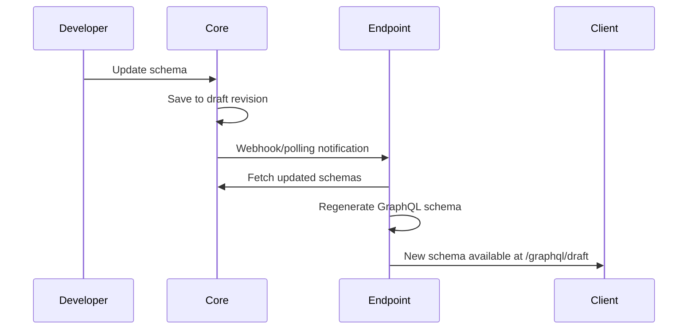
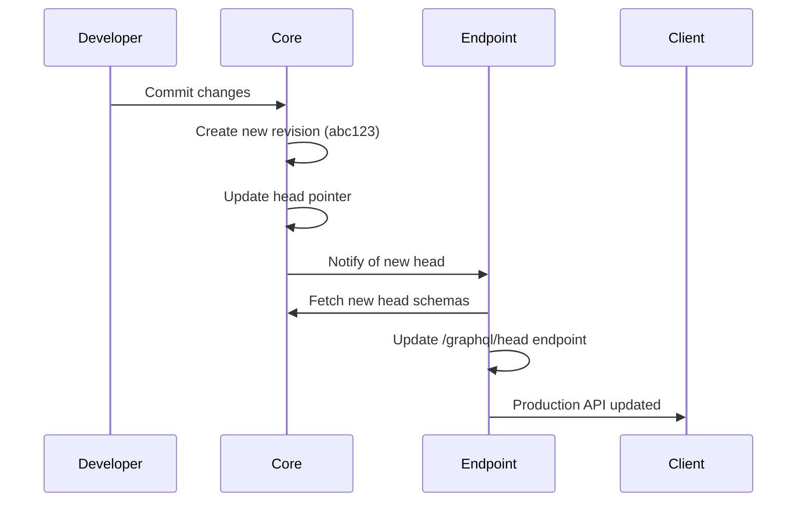

# Revision Lifecycle & Auto-Updates

## Git-like Revision System

Revisium uses a Git-inspired versioning system where each schema change creates a new revision. Endpoints automatically track and update based on these revisions.

### Revision Types

#### Draft Revision
- **URL**: `/graphql/draft`
- **Purpose**: Development and testing
- **Behavior**: Reflects current working state, including uncommitted changes
- **Auto-update**: Updates immediately when schemas are modified

#### Head Revision  
- **URL**: `/graphql/head`
- **Purpose**: Production API
- **Behavior**: Points to the latest committed revision
- **Auto-update**: Updates only when new revisions are committed

#### Specific Revision
- **URL**: `/graphql/revision-abc123`
- **Purpose**: Version pinning and rollbacks
- **Behavior**: Immutable, always returns the same schema/data
- **Auto-update**: Never changes

## Automatic Endpoint Updates

### On Schema Changes (Draft)


### On Commit (Head)


## Development Workflow

### 1. Schema Development
```bash
# Work with draft endpoint during development
curl -X POST https://endpoint.com/graphql/draft \
  -H "Content-Type: application/json" \
  -d '{"query": "{ products { totalCount } }"}'
```

### 2. Testing & Validation
```bash
# Test your changes against draft
npm run test:graphql -- --endpoint=draft
```

### 3. Production Deployment  
```bash
# Commit changes in Core (creates new revision)
curl -X POST https://core.com/api/revisions/commit

# Head endpoint automatically updates
curl -X POST https://endpoint.com/graphql/head \
  -H "Content-Type: application/json" \
  -d '{"query": "{ products { totalCount } }"}'
```

### 4. Rollback Support
```bash
# Pin to specific revision if needed
curl -X POST https://endpoint.com/graphql/revision-abc123 \
  -H "Content-Type: application/json" \
  -d '{"query": "{ products { totalCount } }"}'
```

## Schema Evolution Examples

import Tabs from '@theme/Tabs';
import TabItem from '@theme/TabItem';

### Adding New Fields

<Tabs>
<TabItem value="before" label="Before (Revision abc123)">

```json
{
  "type": "object",
  "properties": {
    "name": {
      "type": "string"
    },
    "price": {
      "type": "number"
    }
  }
}
```

```graphql
type ProjectProduct {
  name: String
  price: Float
}
```

</TabItem>
<TabItem value="draft" label="Draft (Working Changes)">

```json
{
  "type": "object",
  "properties": {
    "name": {
      "type": "string"
    },
    "price": {
      "type": "number"
    },
    "sku": {
      "type": "string",
      "description": "Product stock keeping unit"
    },
    "specifications": {
      "type": "object",
      "properties": {
        "weight": {
          "type": "number"
        },
        "color": {
          "type": "string",
          "enum": ["black", "white", "silver"]
        }
      }
    }
  }
}
```

```graphql
# Available at /graphql/draft immediately
type ProjectProduct {
  name: String
  price: Float
  sku: String  # ← New field
  specifications: ProjectProductSpecifications  # ← New nested object
}

type ProjectProductSpecifications {
  weight: Float
  color: ProjectProductSpecificationsColorEnum
}

enum ProjectProductSpecificationsColorEnum {
  black
  white
  silver
}
```

</TabItem>
<TabItem value="committed" label="After Commit (New Head def456)">

```graphql
# Available at /graphql/head after commit
# Available at /graphql/revision-def456 permanently
type ProjectProduct {
  name: String
  price: Float
  sku: String
  specifications: ProjectProductSpecifications
}
```

</TabItem>
</Tabs>

### Breaking Changes

<Tabs>
<TabItem value="breaking" label="Breaking Change Example">

```graphql
# Before: /graphql/revision-abc123
type ProjectProduct {
  name: String
  price: Float
  weight: Float  # This field will be removed
}

# After: /graphql/revision-def456  
type ProjectProduct {
  name: String
  price: Float
  specifications: ProjectProductSpecifications  # Replaced weight with specifications
  category: ProjectProductCategory  # New nested structure
}
```

</TabItem>
<TabItem value="migration" label="Migration Strategy">

```javascript
// Client code can handle both versions
const GET_PRODUCT = gql`
  query GetProduct($id: String!) {
    product(id: $id) {
      data {
        name
        price
        # Handle both old and new schema versions
        ... on ProjectProduct {
          weight      # Available in old revisions
          specifications {  # Available in new revisions
            weight
            color
          }
          category {
            name
          }
        }
      }
    }
  }
`;
```

</TabItem>
</Tabs>

## Revision Management

### List Available Revisions
```bash
# Get all revisions for a project
curl -H "Authorization: Bearer $TOKEN" \
  https://core.com/api/projects/my-project/revisions
```

### Schema Comparison
```bash
# Compare schemas between revisions
curl -H "Authorization: Bearer $TOKEN" \
  https://core.com/api/revisions/abc123/compare/def456
```

### Rollback Head Pointer
```bash
# Rollback head to previous revision
curl -X PUT -H "Authorization: Bearer $TOKEN" \
  https://core.com/api/projects/my-project/head \
  -d '{"revisionId": "abc123"}'
```

## Client Strategies

### Version-Aware Clients
```typescript
interface GraphQLConfig {
  endpoint: string;
  revision?: string;
}

class VersionAwareClient {
  private config: GraphQLConfig;

  constructor(config: GraphQLConfig) {
    this.config = config;
  }

  getEndpoint(): string {
    const base = this.config.endpoint;
    if (this.config.revision) {
      return `${base}/revision-${this.config.revision}`;
    }
    return `${base}/head`;
  }
}

// Usage
const prodClient = new VersionAwareClient({
  endpoint: 'https://api.example.com/graphql',
  revision: 'abc123' // Pin to specific version
});

const devClient = new VersionAwareClient({
  endpoint: 'https://api.example.com/graphql/draft'
});
```

### Graceful Schema Migrations
```typescript
// Handle schema evolution gracefully
const GET_PRODUCT_FLEXIBLE = gql`
  query GetProduct($id: String!) {
    product(id: $id) {
      data {
        name
        price
        
        # Try new field first, fallback to old
        ... on ProjectProduct @include(if: $hasNewSchema) {
          specifications {
            weight
            color
          }
          category {
            name
          }
        }
        
        ... on ProjectProduct @include(if: $hasOldSchema) {
          weight
        }
      }
    }
  }
`;
```

## Monitoring & Alerts

### Schema Change Notifications
```yaml
# Example webhook configuration
webhooks:
  - url: https://your-app.com/webhooks/schema-changed
    events:
      - revision.committed
      - schema.updated
    headers:
      Authorization: "Bearer webhook-token"
```

### Health Checks
```bash
# Monitor endpoint health across revisions
curl https://endpoint.com/health/revisions

# Response
{
  "draft": {
    "status": "healthy",
    "lastUpdate": "2025-01-15T10:30:00Z",
    "schemaVersion": "draft-current"
  },
  "head": {
    "status": "healthy", 
    "revision": "def456",
    "schemaGenerated": "2025-01-15T09:15:00Z"
  },
  "available_revisions": ["abc123", "def456"]
}
```

## Best Practices

### Development Workflow
1. **Always use draft** during development
2. **Test thoroughly** before committing
3. **Use specific revisions** for version pinning
4. **Monitor breaking changes** with proper tooling

### Production Deployment
1. **Blue/green deployments** with revision pinning
2. **Gradual rollouts** using revision-specific endpoints  
3. **Rollback plans** with previous revision endpoints
4. **Schema validation** in CI/CD pipelines

### Client Management
1. **Version awareness** in client applications
2. **Graceful degradation** for schema changes
3. **Monitoring** for schema evolution impacts
4. **Testing** against multiple revisions