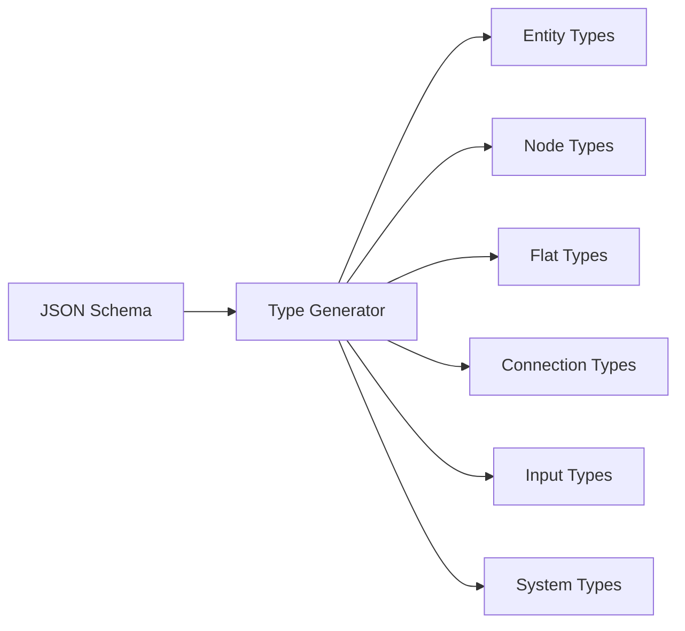

# GraphQL Types

Reference for all types generated by Revisium Endpoint from your JSON schemas.

## Type System Overview

Revisium automatically generates a comprehensive set of GraphQL types from your JSON schema definitions:

- **Entity Types** - Core data structures from your schemas
- **Node Types** - Full entities with system metadata  
- **Flat Types** - Simplified data-only representations
- **Connection Types** - Relay-style pagination wrappers
- **Input Types** - For filtering, sorting, and querying
- **System Types** - Shared utilities (PageInfo, filters, enums)

## Type Generation Process



From a single JSON schema definition, the system generates:

1. **Core Types** for data representation
2. **Query Types** for data retrieval
3. **Filter Types** for WHERE conditions
4. **Sort Types** for ordering results
5. **Pagination Types** for result navigation

## Example Type Generation

From this JSON schema:

```json
{
  "type": "object",
  "properties": {
    "name": { "type": "string" },
    "email": { "type": "string", "format": "email" },
    "active": { "type": "boolean", "default": true }
  },
  "required": ["name", "email"]
}
```

Generates these GraphQL types:

```graphql
# Entity type
type ProjectUser {
  name: String!
  email: String!
  active: Boolean!
}

# Node type (with metadata)
type ProjectUserNode {
  id: String!
  createdAt: DateTime!
  data: ProjectUser!
}

# Flat type (simplified)
type ProjectUserFlat {
  name: String!
  email: String!
  active: Boolean!
}

# Connection types
type ProjectUserConnection {
  edges: [ProjectUserEdge!]!
  pageInfo: ProjectPageInfo!
  totalCount: Int!
}
```

## Type Configuration

Customize generated types through environment variables:

```bash
# Control type visibility
GRAPHQL_HIDE_NODE_TYPES=false
GRAPHQL_HIDE_FLAT_TYPES=false

# Customize naming
GRAPHQL_PREFIX_FOR_TABLES=MyProject
GRAPHQL_FLAT_POSTFIX=Simple
GRAPHQL_NODE_POSTFIX=Full
```

## Type Reference Sections

- [Generated Types](./generated) - Entity, Node, Flat, and Connection types
- [System Types](./system) - Filters, pagination, and utility types

## Next Steps

Explore the detailed type documentation:

- [Generated Types](./generated) - Complete reference for all generated types
- [System Types](./system) - System-wide types and utilities