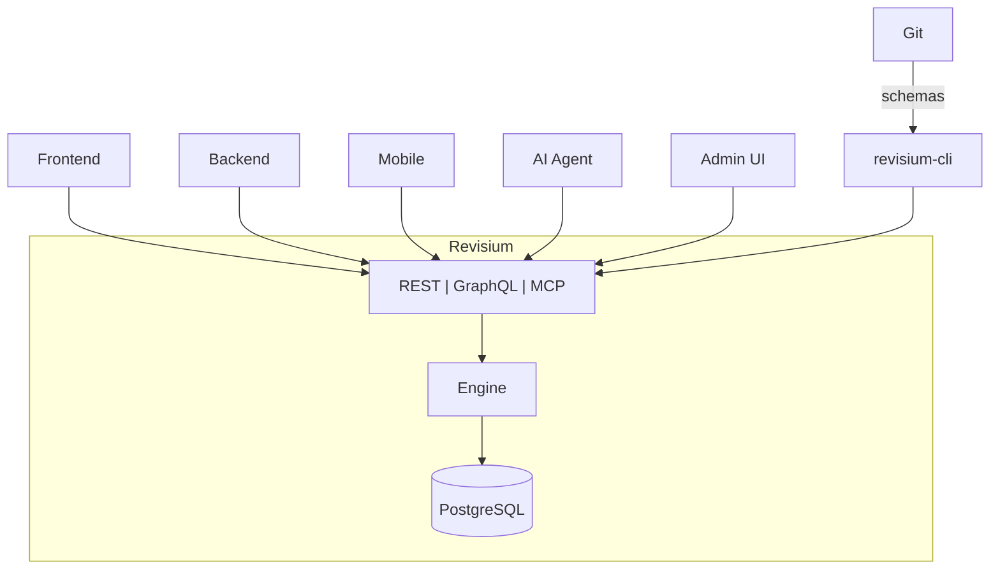

import Screenshot from '@site/src/components/Screenshot';
import { ScreenshotRow } from '@site/src/components/Screenshot';
import Tabs from '@theme/Tabs';
import TabItem from '@theme/TabItem';

<div style={{textAlign: 'center'}}>

<h1>Revisium</h1>

**Your schema. Your data. Full control.**

Build your own Headless CMS, Dictionary Service, Configuration Store, AI Agent Memory, Knowledge Base — or anything that needs structured data with versioning.

</div>

## Key Features

### Admin UI

Visual schema editor, table views with filters/sorts, row editor, diff viewer, change review, branch management.

<Screenshot alt="Admin UI — table editor with filtering, nested field columns, and inline editing" src="/img/screenshots/admin-ui-table-editor.png" />

[Learn more →](./admin-ui/)

### Data Modeling

Model any data structure based on JSON Schema — strings, numbers, booleans, nested objects, arrays of objects. Schema is enforced on every write.

<Tabs>
<TabItem value="data" label="Data" default>

```json
{
  "title": "iPhone 16 Pro",
  "price": 999,
  "inStock": true,
  "specs": {
    "weight": 199,
    "tags": ["5G", "USB-C", "ProMotion"]
  },
  "variants": [
    { "color": "Desert Titanium", "storage": 256 },
    { "color": "Black Titanium", "storage": 512 }
  ]
}
```

</TabItem>
<TabItem value="schema" label="Schema">

```json
{
  "type": "object",
  "properties": {
    "title": { "type": "string", "default": "" },
    "price": { "type": "number", "default": 0 },
    "inStock": { "type": "boolean", "default": false },
    "specs": {
      "type": "object",
      "properties": {
        "weight": { "type": "number", "default": 0 },
        "tags": { "type": "array", "items": { "type": "string" }, "default": [] }
      }
    },
    "variants": {
      "type": "array",
      "items": {
        "type": "object",
        "properties": {
          "color": { "type": "string", "default": "" },
          "storage": { "type": "number", "default": 0 }
        }
      },
      "default": []
    }
  }
}
```

</TabItem>
</Tabs>

[Learn more →](./core-concepts/data-modeling)

### Foreign Keys

Referential integrity between tables — validation on write, cascade rename, delete protection. FK fields are auto-resolved in generated APIs.

<Tabs>
<TabItem value="data" label="Data" default>

```json
{
  "title": "iPhone 16 Pro",
  "category": "electronics",
  "relatedProducts": ["macbook-m4", "airpods-pro"]
}
```

`category` → row in `categories` table, `relatedProducts` → array of rows in `products` table.

</TabItem>
<TabItem value="schema" label="Schema">

```json
"category": {
  "type": "string",
  "default": "",
  "foreignKey": "categories"
},
"relatedProducts": {
  "type": "array",
  "items": { "type": "string", "default": "", "foreignKey": "products" },
  "default": []
}
```

</TabItem>
</Tabs>

[Learn more →](./core-concepts/foreign-keys)

### Computed Fields

Read-only fields with `x-formula` expressions — 40+ built-in functions, aggregations over arrays.

<Tabs>
<TabItem value="data" label="Data" default>

```json
{
  "price": 999,
  "quantity": 50,
  "total": 49950,
  "inStock": true,
  "label": "iPhone 16 Pro — $999"
}
```

`total`, `inStock`, `label` are computed automatically.

</TabItem>
<TabItem value="schema" label="Schema">

```json
"total": { "type": "number", "default": 0, "x-formula": "price * quantity" },
"inStock": { "type": "boolean", "default": false, "x-formula": "quantity > 0" },
"label": { "type": "string", "default": "", "x-formula": "title + \" — $\" + price" }
```

</TabItem>
</Tabs>

[Learn more →](./core-concepts/computed-fields)

### Files

S3 file attachments at any schema level — images, documents, galleries. Automatic metadata after upload.

<Tabs>
<TabItem value="data" label="Data" default>

```json
{
  "title": "iPhone 16 Pro",
  "cover": {
    "url": "https://s3.../cover.jpg",
    "size": 340000,
    "mimeType": "image/jpeg"
  },
  "gallery": [
    { "url": "https://s3.../front.jpg", "size": 280000, "mimeType": "image/jpeg" },
    { "url": "https://s3.../back.jpg", "size": 310000, "mimeType": "image/jpeg" }
  ]
}
```

</TabItem>
<TabItem value="schema" label="Schema">

```json
"cover": { "$ref": "File" },
"gallery": {
  "type": "array",
  "items": { "$ref": "File" }
}
```

</TabItem>
</Tabs>

[Learn more →](./core-concepts/files)

### Versioning

Branches, revisions, drafts — full history, diff, rollback. Draft → review → commit workflow.

<Screenshot alt="Branch Map — branches, revisions, and API endpoints" src="/img/screenshots/branch-map.png" />

<Screenshot alt="Row diff — field-level changes with old and new values" src="/img/screenshots/row-diff.png" />

[Learn more →](./core-concepts/versioning)

### Schema Evolution

Change types, add/remove/move fields — existing data transforms automatically. No manual data migration needed.

- **Add field** — existing rows get the default value
- **Remove field** — data cleaned from all rows
- **Change type** — automatic conversion (string ↔ number ↔ boolean)
- **Move field** — field relocated, data preserved

<Screenshot alt="Schema Evolution — review changes before applying (field added, field removed)" src="/img/screenshots/schema-evolution.png" />

[Learn more →](./core-concepts/schema-evolution)

### Migrations CLI

Auto-generated migrations, portable across environments via CI/CD.

```bash
npx revisium schema save --folder ./schemas
npx revisium migrate create-migrations --schemas-folder ./schemas --file ./migrations.json
npx revisium migrate apply --file ./migrations.json
```

[Learn more →](./migrations/)

### APIs

System API (GraphQL, REST, MCP) for management + auto-generated typed APIs from your schema.

```graphql
query {
  products(data: {
    where: {
      data: { path: ["category"], equals: "electronics" }
    }
    orderBy: [
      { data: { path: "price", direction: "desc", type: "float" } }
    ]
    first: 10
  }) {
    edges {
      node {
        data {
          title
          price
          category { name }
        }
      }
    }
  }
}
```

[Learn more →](./apis/)

### Self-Hosted

Apache 2.0, your infrastructure, no vendor lock-in. Or use [Revisium Cloud](https://cloud.revisium.io/signup).

- **Standalone** — `npx @revisium/standalone@latest` (embedded PostgreSQL, zero config)
- **Docker Compose** — full stack with PostgreSQL, recommended for production
- **Kubernetes** — Helm chart, horizontal scaling

[Learn more →](./deployment/)

## Revisium in Your Stack



- **Frontend, Backend, Mobile** — consume data via auto-generated REST and GraphQL APIs
- **AI Agents** — interact via MCP protocol (create schemas, manage data, commit)
- **Admin UI** — ready-made UI for schema design, data management, and change review
- **CI/CD** — export schemas to Git, apply migrations across environments with revisium-cli

## Next Steps

- **[Quick Start](./quick-start)** — Get Revisium running in under 2 minutes
- **[Core Concepts](./core-concepts/)** — Data model, schemas, versioning
- **[Admin UI](./admin-ui/)** — Visual schema design and data management
- **[APIs](./apis/)** — System API, generated APIs, MCP
- **[Use Cases](./use-cases/)** — Headless CMS, Dictionary, Config Store, AI Memory
