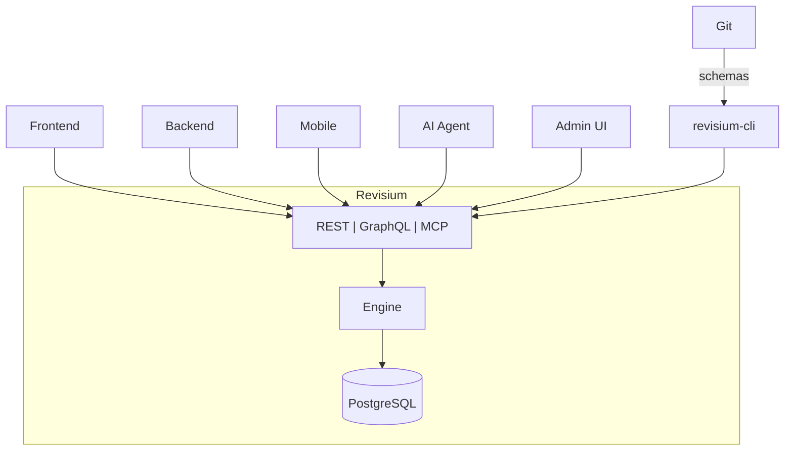

import Screenshot from '@site/src/components/Screenshot';
import { ScreenshotRow } from '@site/src/components/Screenshot';
import Tabs from '@theme/Tabs';
import TabItem from '@theme/TabItem';

<h1>Revisium</h1>

<p className="intro-tagline">Your schema. Your data. Full control.</p>

<p className="intro-usecases">Build your own Headless CMS, Dictionary Service, Configuration Store, AI Agent Memory, Knowledge Base — or anything that needs structured data with integrity. Versioning when you need it.</p>

## Key Features

### One Platform, Many Interfaces

Work with Revisium however fits your workflow — all interfaces access the same data.

- Admin UI — visual schema design, data editing, change review — no code needed
- GraphQL — system API for management + auto-generated typed queries from your schema
- REST — system API + auto-generated OpenAPI endpoints
- MCP — AI agents create schemas, manage data, and commit via Model Context Protocol
- CLI — export schemas and data, generate migrations, seed instances, apply across environments in CI/CD

### Admin UI

Visual schema editor, table views with filters/sorts, row editor, diff viewer, change review, branch management, and more.

<Screenshot alt="Admin UI — table editor with filtering, nested field columns, and inline editing" src="/img/screenshots/admin-ui-table-editor.png" />

[Learn more →](./admin-ui/)

### Data Modeling

Model any data structure based on JSON Schema — strings, numbers, booleans, nested objects, arrays of objects. Schema is enforced on every write.

<Tabs>
<TabItem value="data" label="Data" default>

```json
{
  "title": "iPhone 16 Pro",
  "price": 999,
  "inStock": true,
  "specs": {
    "weight": 199,
    "tags": ["5G", "USB-C", "ProMotion"]
  },
  "variants": [
    { "color": "Desert Titanium", "storage": 256 },
    { "color": "Black Titanium", "storage": 512 }
  ]
}
```

</TabItem>
<TabItem value="schema" label="Schema">

```json
{
  "type": "object",
  "properties": {
    "title": { "type": "string", "default": "" },
    "price": { "type": "number", "default": 0 },
    "inStock": { "type": "boolean", "default": false },
    "specs": {
      "type": "object",
      "properties": {
        "weight": { "type": "number", "default": 0 },
        "tags": { "type": "array", "items": { "type": "string", "default": "" } }
      },
      "required": ["weight", "tags"]
    },
    "variants": {
      "type": "array",
      "items": {
        "type": "object",
        "properties": {
          "color": { "type": "string", "default": "" },
          "storage": { "type": "number", "default": 0 }
        },
        "required": ["color", "storage"]
      }
    }
  },
  "required": ["title", "price", "inStock", "specs", "variants"]
}
```

</TabItem>
</Tabs>

[Learn more →](./core-concepts/data-modeling)

### Foreign Keys

Referential integrity between tables — validation on write, cascade rename, delete protection. FK fields are auto-resolved in generated APIs.

<Tabs>
<TabItem value="data" label="Data" default>

```json
{
  "title": "iPhone 16 Pro",
  "category": "electronics",
  "relatedProducts": ["macbook-m4", "airpods-pro"]
}
```

`category` → row in `categories` table, `relatedProducts` → array of rows in `products` table.

</TabItem>
<TabItem value="schema" label="Schema">

```json
{
  "type": "object",
  "properties": {
    "title": { "type": "string", "default": "" },
    "category": {
      "type": "string",
      "default": "",
      "foreignKey": "categories"
    },
    "relatedProducts": {
      "type": "array",
      "items": { "type": "string", "default": "", "foreignKey": "products" }
    }
  },
  "required": ["title", "category", "relatedProducts"]
}
```

</TabItem>
</Tabs>

[Learn more →](./core-concepts/foreign-keys)

### Computed Fields

Read-only fields with `x-formula` expressions — 40+ built-in functions, aggregations over arrays.

<Tabs>
<TabItem value="data" label="Data" default>

```json
{
  "title": "iPhone 16 Pro",
  "price": 999,
  "quantity": 50,
  "total": 49950,
  "inStock": true,
  "label": "iPhone 16 Pro — $999"
}
```

</TabItem>
<TabItem value="schema" label="Schema">

```json
{
  "type": "object",
  "properties": {
    "title": { "type": "string", "default": "" },
    "price": { "type": "number", "default": 0 },
    "quantity": { "type": "number", "default": 0 },
    "total": {
      "type": "number", "default": 0, "readOnly": true,
      "x-formula": { "version": 1, "expression": "price * quantity" }
    },
    "inStock": {
      "type": "boolean", "default": false, "readOnly": true,
      "x-formula": { "version": 1, "expression": "quantity > 0" }
    },
    "label": {
      "type": "string", "default": "", "readOnly": true,
      "x-formula": { "version": 1, "expression": "title + \" — $\" + price" }
    }
  },
  "required": ["title", "price", "quantity", "total", "inStock", "label"],
  "additionalProperties": false
}
```

</TabItem>
</Tabs>

<Screenshot alt="Computed fields in table — label, inStock, total calculated automatically" src="/img/screenshots/computed-table.png" />

<Screenshot alt="Computed fields in row editor — formula icon on computed values" src="/img/screenshots/computed-row.png" />

`total`, `inStock`, `label` are computed automatically from `title`, `price`, `quantity`.

[Learn more →](./core-concepts/computed-fields)

### Files

S3 file attachments at any schema level — images, documents, galleries. Use embedded file fields directly in your tables, or create a dedicated assets table for reuse. Unopinionated — structure it however fits your project.

<Tabs>
<TabItem value="data" label="Data" default>

```json
{
  "title": "iPhone 16 Pro",
  "cover": {
    "status": "uploaded",
    "fileId": "abc123",
    "url": "https://s3.../cover.jpg",
    "fileName": "cover.jpg",
    "hash": "sha256...",
    "extension": "jpg",
    "mimeType": "image/jpeg",
    "size": 340000,
    "width": 1200,
    "height": 800
  },
  "gallery": [
    {
      "status": "uploaded",
      "fileId": "def456",
      "url": "https://s3.../front.jpg",
      "fileName": "front.jpg",
      "hash": "sha256...",
      "extension": "jpg",
      "mimeType": "image/jpeg",
      "size": 280000,
      "width": 1200,
      "height": 800
    },
    {
      "status": "uploaded",
      "fileId": "ghi789",
      "url": "https://s3.../back.jpg",
      "fileName": "back.jpg",
      "hash": "sha256...",
      "extension": "jpg",
      "mimeType": "image/jpeg",
      "size": 310000,
      "width": 1200,
      "height": 800
    }
  ]
}
```

</TabItem>
<TabItem value="schema" label="Schema">

```json
{
  "type": "object",
  "properties": {
    "title": { "type": "string", "default": "" },
    "cover": { "$ref": "urn:jsonschema:io:revisium:file-schema:1.0.0" },
    "gallery": {
      "type": "array",
      "items": { "$ref": "urn:jsonschema:io:revisium:file-schema:1.0.0" }
    }
  },
  "required": ["title", "cover", "gallery"]
}
```

</TabItem>
</Tabs>

[Learn more →](./core-concepts/files)

### Versioning

Branches, revisions, drafts. Every commit is an immutable snapshot — access any revision at any time. Full history, diff, rollback. Draft → review → commit workflow.

<Screenshot alt="Branch Map — branches, revisions, and API endpoints" src="/img/screenshots/branch-map.png" />

<Screenshot alt="Row diff — field-level changes with old and new values" src="/img/screenshots/row-diff.png" />

[Learn more →](./core-concepts/versioning)

### Schema Evolution

Change types, add/remove/move fields — existing data transforms automatically. No manual data migration needed.

- **Add field** — existing rows get the default value
- **Remove field** — data cleaned from all rows
- **Change type** — automatic conversion (string ↔ number ↔ boolean)
- **Move field** — field relocated, data preserved

<Screenshot alt="Schema Evolution — review changes before applying (field added, field removed)" src="/img/screenshots/schema-evolution.png" />

[Learn more →](./core-concepts/schema-evolution)

### Migrations CLI

Auto-generated migrations, portable across environments via CI/CD.

```bash
# Export migrations from source instance
npx revisium migrate save --file ./migrations.json

# Apply to target instance
npx revisium migrate apply --file ./migrations.json
```

[Learn more →](./migrations/)

### Data Portability

Download your schemas and data at any time. Upload to seed a new instance or restore from backup. You own your data — export it, version it in Git, move it between environments.

```bash
# Download all schemas
npx revisium schema save --folder ./schemas

# Download all data
npx revisium data save --folder ./data

# Upload to another instance
npx revisium data apply --folder ./data
```

[Learn more →](./migrations/)

### APIs

Two layers: system API for management + auto-generated typed APIs from your schema.

<Tabs>
<TabItem value="gen-graphql" label="Generated GraphQL" default>

Auto-generated typed schema from your tables. Filtering, sorting, pagination, FK resolution.

```graphql
query {
  products(data: {
    where: { data: { path: ["category"], equals: "electronics" } }
    orderBy: [{ data: { path: "price", direction: "desc", type: "float" } }]
    first: 10
  }) {
    edges {
      node { data { title, price, category { name } } }
    }
  }
}
```

Response:

```json
{
  "data": {
    "products": {
      "edges": [
        {
          "node": {
            "data": {
              "title": "iPhone 16 Pro",
              "price": 999,
              "category": { "name": "Electronics" }
            }
          }
        }
      ]
    }
  }
}
```

Generated schema (excerpt):

```graphql
type ProjectProduct {
  title: String!
  price: Float!
  category: ProjectCategory  # FK auto-resolved
}

type ProjectProductNode {
  id: String!
  createdAt: DateTime!
  updatedAt: DateTime!
  data: ProjectProduct!
}

type Query {
  product(id: String!): ProjectProductNode
  products(data: ProjectGetProductsInput): ProjectProductConnection
}
```

</TabItem>
<TabItem value="gen-rest" label="Generated REST">

Auto-generated OpenAPI endpoints for each table.

```bash
GET /endpoint/rest/<org>/<project>/<branch>/head/tables/products/row/iphone-16
```

Response:

```json
{
  "id": "iphone-16",
  "versionId": "R0OIlByTNIo...",
  "createdId": "UowRo8yO_AD...",
  "createdAt": "2026-03-15T10:30:00Z",
  "updatedAt": "2026-03-15T14:20:00Z",
  "publishedAt": "2026-03-15T10:30:00Z",
  "readonly": true,
  "data": {
    "title": "iPhone 16 Pro",
    "price": 999,
    "category": "electronics"
  }
}
```

Generated OpenAPI spec (excerpt):

```yaml
paths:
  /tables/products/row/{rowId}:
    get:
      operationId: get_products
      summary: Get products by ID
  /tables/products/rows:
    post:
      operationId: query_products
      summary: Query products rows
components:
  schemas:
    Products:
      type: object
      properties:
        title: { type: string }
        price: { type: number }
        category: { type: string }
```

</TabItem>
<TabItem value="sys-graphql" label="System GraphQL">

Full platform management — projects, branches, tables, rows, revisions.

```graphql
# POST /graphql
mutation {
  createTable(data: {
    revisionId: "<draftRevisionId>"
    tableId: "products"
    schema: { ... }
  }) { id }
}
```

Response:

```json
{
  "data": {
    "createTable": {
      "id": "products"
    }
  }
}
```

</TabItem>
<TabItem value="sys-rest" label="System REST">

Same operations via REST endpoints.

```bash
POST /api/revision/<draftRevisionId>/tables/products/create-row
Content-Type: application/json

{ "rowId": "iphone-16", "data": { "title": "iPhone 16 Pro", "price": 999 } }
```

Response:

```json
{
  "id": "iphone-16",
  "versionId": "SN37liH-kBe...",
  "createdAt": "2026-03-15T10:30:00Z",
  "updatedAt": "2026-03-15T10:30:00Z",
  "readonly": false,
  "data": {
    "title": "iPhone 16 Pro",
    "price": 999
  }
}
```

</TabItem>
<TabItem value="mcp" label="MCP">

AI agents interact via Model Context Protocol — full CRUD, schema design, commits.

```bash
claude mcp add --transport http revisium http://localhost:9222/mcp
```

```
You: Create a "products" table with title, price, and category fields
Claude: [Uses createTable tool] Created table "products" with 3 fields.

You: Add row "iphone-16" with title "iPhone 16 Pro" and price 999
Claude: [Uses createRow tool] Created row "iphone-16" in products.
```

</TabItem>
</Tabs>

[Learn more →](./apis/)

### Platform Hierarchy

Separate teams, projects, and environments. Each with its own branches, version history, and API endpoints.

[Learn more →](./core-concepts/platform-hierarchy)

### Self-Hosted

Apache 2.0, your infrastructure, no vendor lock-in. Or use [Revisium Cloud](https://cloud.revisium.io/signup).

- **Standalone** — `npx @revisium/standalone@latest` (embedded PostgreSQL, zero config)
- **Docker Compose** — full stack with PostgreSQL, recommended for production
- **Kubernetes** — Helm chart, horizontal scaling

[Learn more →](./deployment/)

## Revisium in Your Stack



- **Frontend, Backend, Mobile** — consume data via auto-generated REST and GraphQL APIs
- **AI Agents** — interact via MCP protocol (create schemas, manage data, commit)
- **Admin UI** — ready-made UI for schema design, data management, and change review
- **CI/CD** — export schemas to Git, apply migrations across environments with revisium-cli

## Next Steps

- **[Quick Start](./quick-start)** — Get Revisium running in under 2 minutes
- **[Core Concepts](./core-concepts/)** — Data model, schemas, versioning
- **[Admin UI](./admin-ui/)** — Visual schema design and data management
- **[APIs](./apis/)** — System API, generated APIs, MCP
- **[Use Cases](./use-cases/)** — Headless CMS, Dictionary, Config Store, AI Memory
